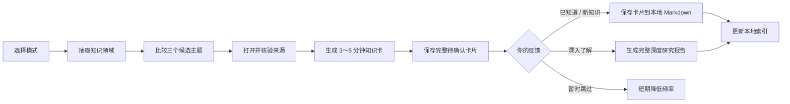

<div align="center">

# Boundary

**每天跨出信息茧房一点点。**

A verified daily knowledge skill for discovering what you did not know to ask.

[](https://agentskills.io)
[](https://github.com/xingxingzhou469-max/boundary-skill/stargazers)
[](https://github.com/xingxingzhou469-max/boundary-skill/commits/main)
[](#english)

[为什么需要它](#为什么需要-boundary) · [实际效果](#一张卡片是什么样的) · [安装](#安装) · [工作方式](#它如何工作) · [English](#english)

</div>

---

Boundary 不会继续推荐"更多你已经喜欢的内容"。

它每天主动选择一个你大概率没有接触过、但值得知道的主题，查证来源，整理成一张 3～5 分钟可以读完的知识卡。想深入时，它会展开成一份完整、深入但通俗易懂的研究报告。历史、生命科学、金融、建筑、语言、法律、宗教、材料、地理……世界不应该只剩下算法认为你会点击的那一小部分。

## 为什么需要 Boundary

普通推荐系统擅长预测你还会喜欢什么，却不擅长发现你从未想过要搜索什么。

Boundary 的目标不是增加信息量，而是扩大认知范围：

- 不通过兴趣问卷预先定义你是谁；
- 不读取其他聊天来推断政治立场、信仰或人格；
- 不因为一次"跳过"就永久隐藏整个领域；
- 不把随机冷知识、热点新闻或模型记忆包装成学习；
- 每张卡片都必须经过查证并附上可以打开的来源。

## 一张卡片是什么样的

```text
今天的边界 · 巨津巴布韦：被误读的非洲石城

核心知识
约 11～15 世纪，当地绍纳文化相关社群建造了一座大型石城。
遗址中的中国与波斯瓷器、玻璃珠和基尔瓦金币，说明它通过
东非海岸参与了印度洋贸易网络。

为什么值得知道
殖民时期的部分研究者不愿承认当地非洲社会能够建造如此复杂
的城市，曾将其错误归因于外来群体。考古不仅是在发现材料，
研究者原有的世界观也可能影响他们如何解释材料。

向外连接
一件中国瓷器首先证明贸易联系，并不证明"中国人建造了城市"。
区分物品来源和社会创造者，是理解考古证据的重要能力。

可信度：高
来源：UNESCO · The Metropolitan Museum of Art · University of Cape Town

下一步：已知道 / 新知识 / 深入了解 / 暂时跳过
```

这不是预先写死的题库。每次运行都会先选择领域、比较候选主题，再打开来源进行核验。

## 两种发现模式

| 模式 | 它怎样选题 | 适合什么时刻 |
|---|---|---|
| 🧭 **边界模式** | 优先进入近期覆盖较少的领域，再选择具有长期价值、跨领域连接和可靠证据的主题 | 想系统扩大知识版图 |
| 🎲 **漫游模式** | 先随机抽取领域，再寻找其中可验证、有解释价值的意外主题 | 想遇见真正没想过的东西 |

你也可以选择两种模式交替出现。

## 它如何工作



### 十二个知识领域

1. 宇宙、地球与地理
2. 生物、生态与医学
3. 数学、物理与化学
4. 工程、技术与基础设施
5. 历史与考古
6. 哲学、宗教与伦理
7. 政治、法律与制度
8. 经济、金融与商业
9. 社会学、人类学与心理学
10. 文学、艺术、音乐与建筑
11. 语言、文字与传播
12. 日常生活、农业、食物与材料

选题还会主动轮换国家、文明和知识传统，避免长期只围绕中国、欧美或互联网最常见的叙事。

## 两个阅读层级

Boundary 只有两个层级：先宽泛了解，想深入时一步到底。层级完全由你的操作决定。

| 层级 | 触发方式 | 输出 |
|---|---|---|
| **知识卡** | 默认 | 3～5 分钟直接阅读，至少两个独立来源 |
| **深度研究报告** | 回复"深入了解" | 围绕一个核心问题的一次完整、深入的研究报告：直接答案、背景、最强证据、争议、不确定性和跨领域连接，全部使用通俗语言写成 |

"深入了解"永远生成完整深度的研究报告，不会再出现"简报还是完整报告"之类的二次选择，也不会自动升级成任何后续步骤。每份报告都必须满足十项要求：开头提出一个核心问题；先给直接答案；解释最强证据及其可信原因；使用至少三个可靠且独立的来源；在重要事实旁放链接；说明争议或不确定性；只保留回答问题所需的背景；说明它如何改变、限定或扩展原知识卡；脱离卡片也能独立读懂；不使用未解释的术语和学术腔。

报告以普通 Markdown 保存在 `Reports/`，在手机上的任何阅读器里都能直接打开。

## 可靠性不是装饰

- 所有卡片都必须在生成前查询来源；不能只依赖模型记忆。
- 普通知识至少使用两个相互独立的可靠来源。
- 学术、医疗、金融、法律和争议主题优先使用论文、政府、监管机构、专业组织或原始史料。
- 找不到足够证据时，放弃该主题并重新选择。
- 医疗内容不做个人诊断，金融内容不发买卖指令，法律内容不代替律师意见。
- 对可能变化的事实标明资料日期；对真实争议说明证据强弱。

详细标准见 [`references/source-policy.md`](references/source-policy.md)。

## 本地存储：简单 Markdown，手机友好

Boundary 不需要任何笔记软件、插件或 Vault。它把一切保存为你指定的一个普通文件夹：

```text
<boundary-root>/
├── INDEX.md                 # 知识索引：已确认卡片的一行一个链接
├── Cards/                   # 每张已确认的知识卡一个 Markdown 文件
├── Reports/                 # 深度研究报告（Markdown）
└── _system/
    ├── pending/             # 尚未反馈的完整卡片
    ├── tmp/
    └── state.json           # 透明历史状态
```

所有文件都是普通 Markdown 和 JSON，在任何设备上（包括手机）用任何阅读器都能直接打开；不依赖 Obsidian 或其他特定应用，没有双链、插件或专有格式。每张已经展示的卡片会先完整保存在 `pending/`，因此关闭当前对话后仍然可以继续反馈。被接受的卡片会自动转为正式笔记、写入索引，并保留正文引用、结构化来源和反馈。"暂时跳过"的内容不会污染正式笔记，只会在透明的本地状态中短期避让。

所有数据都保存在用户选择的本地目录，不会上传到 Boundary 服务——因为不存在 Boundary 服务。

## 安装

### Agent Skills CLI

适用于 Codex、Claude Code、Cursor、Gemini CLI、GitHub Copilot 等兼容 Agent Skills 的工具：

```bash
npx skills add https://github.com/xingxingzhou469-max/boundary-skill -g
```

### Codex 手动安装

```bash
git clone https://github.com/xingxingzhou469-max/boundary-skill ~/.codex/skills/boundary
```

重新打开一个任务后，可以直接说：

```text
给我今天的知识边界
今天用漫游模式
给我一个我大概率不知道、但值得知道的知识
Today's boundary, in English
```

首次运行只会询问输出语言、选题模式和保存目录，不会要求填写兴趣问卷。状态脚本只使用 Python 标准库，没有任何第三方依赖。

### 每日自动送达

Boundary 负责选题、查证、生成和记录；定时由你正在使用的 Agent 或自动任务系统负责。完成首次配置后，可以直接告诉支持自动任务的 Agent：

```text
每天上午 9 点运行 Boundary，两种模式交替，生成一张中文知识卡。
```

未经明确要求，Boundary 不会自行创建定时任务或发送消息。

## 仓库结构

```text
boundary-skill/
├── SKILL.md
├── agents/openai.yaml
├── scripts/
│   └── state.py
├── tests/
│   └── test_state_cli.py
└── references/
    ├── domains.md
    ├── storage.md
    ├── output-formats.md
    └── source-policy.md
```

状态脚本只使用 Python 标准库，负责完整卡片暂存、近期领域与地区覆盖、结构化来源校验、重复与跳过冷却、反馈、卡片笔记、索引和深度报告关联。内容研究仍由安装该 Skill 的 Agent 使用其可用搜索工具完成。

## 设计来源

Boundary 借鉴了这些优秀开源项目的思路，并重新组合成一条统一流程：

- [`BelCorentin/curiosity`](https://github.com/BelCorentin/curiosity) — 每日知识体验、向外连接和关联笔记；
- [`Koulb/paper-scout`](https://github.com/Koulb/paper-scout) — 历史记录、去重和每日筛选；
- [`199-biotechnologies/claude-deep-research-skill`](https://github.com/199-biotechnologies/claude-deep-research-skill) — 引用核验和深度研究标准。

它们解决了 Boundary 的一部分问题，但 Boundary 的选题、反馈、十二领域覆盖和防信息茧房逻辑是独立设计的。

---

## English

**Boundary is a verified daily knowledge skill for discovering what you did not know to ask.**

Recommendation systems are good at predicting what you will click next. They are much worse at showing you an important idea from a field you have never thought to explore.

Boundary selects one topic, verifies it against reliable sources, and turns it into a direct 3–5 minute knowledge card. When you want more, it expands into one complete, in-depth research report written in plain language.

### Two discovery modes

| Mode | Selection behavior |
|---|---|
| 🧭 **Boundary** | Prioritizes under-covered domains, then chooses a durable, important, well-supported topic with cross-domain value |
| 🎲 **Wander** | Randomly picks a domain, then finds a verifiable and genuinely unexpected topic inside it |

Both modes reject unsupported trivia, semantic repeats, and topics that cannot be verified with at least two independent sources.

### Two depth levels

The user's action, not the model's judgment, determines the level:

| Level | Trigger | Output |
|---|---|---|
| **Knowledge card** | Default | A direct introduction to what the topic is and why it matters |
| **Deep research report** | Choose `Deep dive` | One complete, in-depth research report around a specific question: direct answer, background, strongest evidence, uncertainty, and cross-domain implications, all in plain language |

`Deep dive` always produces the full in-depth report — there is no intermediate brief and no further depth choice. Every report must state one question, answer it directly, explain the strongest evidence, use at least three strong independent sources, cite important claims in place, state uncertainty, include only needed background, explain how it changes or extends the original card, stand alone without the card, and avoid unexplained jargon.

Reports are saved as plain Markdown under `Reports/` and open in any reader, including on phones.

### What makes it different

- Covers 12 broad domains rather than one news or technology feed.
- Rotates across countries, civilizations, and knowledge traditions.
- Does not build a political, religious, medical, financial, or personality profile.
- A skip only reduces short-term frequency; it never permanently blocks a field.
- Supports Chinese and English with the same evidence standard.
- Saves accepted cards, reports, citations, and the index as plain Markdown and JSON — no vault, plugin, or notes app required.
- Keeps all history in transparent local files.
- Persists the complete shown card before delivery, so feedback still works after the original chat closes.
- Validates structured sources, recent domain and region coverage, duplicate payloads, and skip cooldowns.
- The state script uses only the Python standard library.

### Install

```bash
npx skills add https://github.com/xingxingzhou469-max/boundary-skill -g
```

Or install manually for Codex:

```bash
git clone https://github.com/xingxingzhou469-max/boundary-skill ~/.codex/skills/boundary
```

Then ask:

```text
Give me today's knowledge boundary.
Use Wander mode today.
Teach me something important that is probably outside my field.
```

On first run, Boundary asks only for language, discovery mode, and the save folder. It does not ask for an interest profile or inspect unrelated conversations.

For automatic delivery, ask a host that supports scheduled tasks:

```text
Run Boundary every day at 9:00 AM, alternate both modes, and generate one card in English.
```

Boundary owns selection, research, generation, and history. The host scheduler owns timing. No recurring task is created without explicit permission.

### Privacy and safety

Boundary has no hosted service and uploads no learning history. Medical content is educational rather than diagnostic; financial content avoids direct trading instructions; legal content does not replace professional advice. Claims that may change are dated, and contested topics separate facts, interpretations, and normative positions.

---

<div align="center">

**More information is not always a larger world. Boundary is built for the larger world.**

</div>
