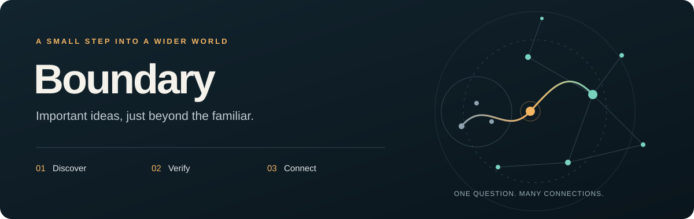

<div align="center">



# Boundary

**发现那些你还不知道该去搜索的重要知识。**

一张查证过的知识卡，十二个探索领域，想深入时一步到底。

[](https://github.com/xingxingzhou469-max/boundary-skill/actions/workflows/ci.yml)
[](LICENSE)
[](docs/getting-started.md#requirements)
[](https://agentskills.io)

[English](README.md) · **简体中文**

[添加 ChatGPT 每日任务](integrations/chatgpt/task.zh-CN.md) · [先读一张卡](examples/card.zh-CN.md) · [本地安装](#开始使用) · [参与改进](CONTRIBUTING.md)

</div>

Boundary 帮你每天理解一个跨领域的重要问题。最方便的入口是在 ChatGPT 中添加每日任务，直接在对话里收卡片；也可以安装为 [Agent Skill](https://agentskills.io)，让已有的 AI Agent 管理本地 Markdown 知识库。适合想扩大认知范围、又不想每天自己挑选主题的人。

说一句“给我今天的知识边界”，Agent 就会寻找一个重要、可迁移的主题，打开可靠来源，整理成 3～5 分钟可以读完的卡片。回复“深入了解”，它会围绕卡片上的核心问题，生成完整、通俗的研究报告。本地 Agent 版本会把卡片、引用和报告保存在你选择的文件夹里；ChatGPT 定时任务版本则直接在任务对话中交付。

## 先看看实际内容

> **为什么海冰融化会进一步促进升温？**
>
> 明亮的表面会反射更多阳光。海冰融化，露出较暗的海水，水面就可能吸收更多太阳能，进一步促进升温。值得带走的概念是**反馈回路**：一个结果，也可能反过来推动它的原因。
>
> 理解这个机制，并不等于能预测某一年究竟会融化多少海冰。

*以上是节选。阅读[完整中文知识卡](examples/card.zh-CN.md)、[英文知识卡](examples/card.en.md)，或[完整英文深研报告](examples/report.en.md)。示例附可打开的来源和查证日期，是编写示例，不是实时运行截图，也不是固定题库。*

## 选择你的入口

| 你想要什么 | 从这里开始 |
|---|---|
| 在 **ChatGPT 定时任务**中收卡片，不装本地工具 | [复制中文任务指令](integrations/chatgpt/task.zh-CN.md) · [English prompt](integrations/chatgpt/task.en.md) |
| 用 Codex 等 Agent 建立**持久的本地 Markdown 知识库** | 按下方步骤安装 |

新用户复制创建指令；已有任务只需[替换执行指令](integrations/chatgpt/instructions.zh-CN.txt)，保留原有时间。定时指令只使用实际可见的历史；此前选过“已知道”“新知识”或“暂时跳过”，仍可对该卡片继续深入。[添加、试读、更新、分享与验收状态 →](integrations/chatgpt/README.md)

## 开始使用

以下安装要求适用于本地 Agent Skill。ChatGPT 用户可直接使用[任务指令](integrations/chatgpt/task.zh-CN.md)，无需 Python 或本地文件夹。

需要一个支持技能、**网页搜索、打开来源、执行命令和读写本地文件**的 Agent，以及 **Python 3.10+**。Boundary 不提供模型或搜索服务，使用量与费用遵循你的 Agent 平台规则。

通过 [Skills CLI](https://github.com/vercel-labs/skills) 安装：

```bash
npx skills add xingxingzhou469-max/boundary-skill --skill boundary -g
```

新开一个 Agent 会话，告诉它：

```text
用 Boundary 给我今天的知识边界。
卡片保存到 /你选择的绝对路径/Boundary。
```

把示例路径换成自己的目录。默认使用当前语言和边界模式；没有提供保存目录时才询问目录，不做兴趣问卷。如果当前环境无法搜索或打开来源，应说明缺少什么能力，不会用模型记忆冒充查证。

[手动安装、环境要求、更新、定时与故障处理 →](docs/getting-started.md)

## 两种探索方式

| 模式 | 选题方式 |
|---|---|
| **边界 Boundary** · 默认 | 优先考虑其他领域的重要概念、机制和制度，近期覆盖只帮助保持广度，不强行凑领域配额。 |
| **漫游 Wander** · 主动选择 | 随机选择探索方向，再通过相同的价值与证据标准。 |
| **交替 Alternate** · 可选设置 | 在边界和漫游之间切换。 |

说“今天用漫游模式”只改变这次选择，不改保存的默认设置。陌生不等于有价值：一个没学过的基础概念，往往比罕见却缺少解释力的冷知识更值得认识。

交替模式依据上一张卡片的模式切换：本地技能使用已记录的模式，ChatGPT 使用对话中实际可见的上一张卡片。避重复仍会检查全部可用历史。一次性的模式请求不会改写以后默认的选题方式。

十二个领域覆盖天地、生物、数理、工程、历史、哲学、制度、经济、社会、艺术、语言与日常材料；详见[选题规则](references/domains.md)。

## 四种反馈，两个阅读层级

**在 ChatGPT 中：**“已知道”“新知识”“暂时跳过”只作简短确认；这些反馈之后仍可“深入了解”，报告在对话中交付。历史与避重复仅依赖实际可见的上下文，详见[任务反馈说明](integrations/chatgpt/README.md#收到卡片之后)。

**本地 Agent Skill 的保存行为：**

| 反馈 | 会发生什么 |
|---|---|
| **已知道** | 保存卡片并加入索引。 |
| **新知识** | 保存卡片，并在本地保留这次反馈。 |
| **深入了解** | 保存卡片，沿用它的核心问题继续查证，关联一份完整报告。 |
| **暂时跳过** | 删除待确认正文，不生成正式笔记；保留元数据，七天内避开同一主题。 |

卡片在展示前就会完整保存，所以关闭对话后还能继续反馈。“深入了解”不会再次询问深度，报告末尾也不会再加一层菜单。一张卡片的反馈确认后不再改写；所有已展示的卡片都计入近期覆盖。跳过只会轻微降低该领域短期出现频率，不会永久屏蔽它。

## 可靠性可以检查，也有边界

- 每张卡至少两个独立发布机构，每份报告至少三个；Agent 必须打开底层来源。
- 重要事实旁放引用链接；卡片增加具体例子、可带走的用法和适用边界，长文检查替代解释并说明证据究竟能证明什么。
- 卡片来源不足时尝试另一个候选；若仍不足，则简短说明限制。报告保留原问题并说明证据缺口。无法联网查证就说明阻塞。
- **脚本只能检查来源字段、重复情况和保存流程，不能自动证明事实正确、来源独立，或网页确实被打开。**
- 医疗、法律、金融与争议主题遵循[专门证据规范](references/source-policy.md)，保持知识教育用途。

[2026-10-06 质量检查记录](docs/evaluation-results.md)公开了七组原生 Agent 测试的改进和剩余精度问题。真实 ChatGPT 定时交付仍未验收。

## 数据是你的普通文件

以下目录由本地 Agent Skill 创建；ChatGPT 任务版在对话中交付内容。

```text
你选择的 Boundary 文件夹/
├── INDEX.md             # 阅读索引
├── Cards/               # 已确认卡片与引用
├── Reports/             # 深度研究报告
└── _system/
    ├── state.json       # 透明的历史与反馈
    ├── pending/         # 等待反馈的完整卡片
    └── tmp/             # 草稿输入
```

不需要笔记插件、专用账号或专有格式。自己传输或同步文件夹后，手机上的 Markdown 阅读器也能打开；Boundary 本身不负责跨设备同步。

**隐私边界：**状态脚本没有网络请求，也没有 Boundary 云服务。但你所用的 Agent 仍会按其平台的数据规则处理提示词、来源和读取到的历史；“本地保存”不代表模型离线运行。Boundary 不读取无关聊天，也不构建政治、宗教、医疗、金融或人格画像。

## 不接模型也能体验保存流程

克隆仓库，在仓库根目录运行：

```bash
python3 scripts/demo.py
```

它会在临时目录里回放示例的“初始化 → 记录 → 重启读取 → 反馈 → 关联报告”，检查文件与双向链接，然后清理临时目录。不联网、不调用模型、不动已有 Boundary 配置。若系统把 Python 3 命名为 `python`，使用该命令即可。

想留下示例供阅读：

```bash
python3 scripts/demo.py --output ./boundary-demo
```

目标目录必须尚不存在。这验证的是保存流程，不是一次新的事实核验或 Agent 研究能力评测。

## 参与改进

```bash
python3 scripts/check_repo.py
python3 scripts/build_task_prompts.py --check
python3 -m unittest discover -v
```

CI 覆盖 Linux、macOS、Windows，以及 Python 3.10 / 3.14；Windows 另需 IANA 时区数据包 `tzdata`。欢迎可复现的故障、引用或选题质量问题、可靠示例和经过实际验证的指令改进。

参阅[贡献指南](CONTRIBUTING.md)与[行为评测场景](docs/evaluation.md)。Python 测试通过不代表生成质量已通过评测。如果 Boundary 帮你理解了一个新问题，欢迎点一个 star，让更多人发现它；具体的使用反馈同样有价值。

## 设计来源与许可证

原始设计参考了 [curiosity](https://github.com/BelCorentin/curiosity) 的每日发现、[paper-scout](https://github.com/Koulb/paper-scout) 的历史筛选，以及 [claude-deep-research-skill](https://github.com/199-biotechnologies/claude-deep-research-skill) 的研究规范。

本轮维护也参考了 [Skills CLI](https://github.com/vercel-labs/skills)、[Anthropic skills](https://github.com/anthropics/skills) 和 [Superpowers](https://github.com/obra/superpowers) 的安装、示例与行为验证方式。研究规则还参考了 [STORM](https://github.com/stanford-oval/storm) 的问题驱动研究和 [GPT Researcher](https://github.com/assafelovic/gpt-researcher) 的来源追踪与综合方法，见[资料地图与方法说明](references/source-map.md)。这些是设计参考，不表示上游背书或内置依赖。

采用 [MIT 许可证](LICENSE)。所链接的资料与上游项目保留各自的许可证和权利。
